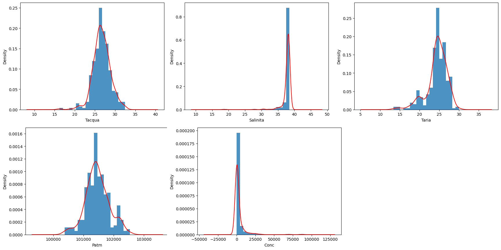
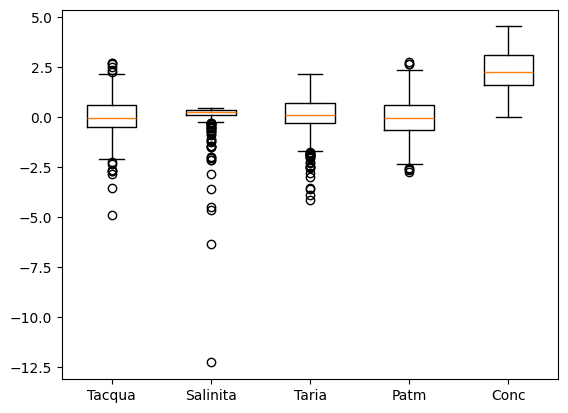
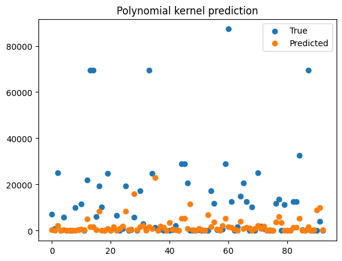

# Previsione della concentrazione di un'alga tossica — analisi e modellazione predittiva

Progetto di data science: analisi esplorativa e costruzione di un modello predittivo per
stimare la concentrazione di un'alga marina tossica a partire da parametri ambientali
(temperatura, salinità, pressione atmosferica) rilevati in diverse stazioni di monitoraggio.

## Obiettivo

Un ente locale ha fornito un dataset di osservazioni ambientali distinte per stazione di
rilevamento. L'obiettivo è costruire uno strumento previsionale che, sulla base delle
condizioni meteo-marine in una stazione, stimi la presenza dell'alga nociva, e valutare se
la stazione di appartenenza sia essa stessa un fattore predittivo rilevante.

## Percorso di analisi

1. **Pulizia e ispezione dei dati** — verifica di valori nulli e duplicati.
2. **Feature understanding** — analisi delle distribuzioni (gran parte delle feature segue
   una distribuzione gaussiana) e delle correlazioni tra variabili tramite pairplot.
3. **Gestione degli outlier** — identificazione tramite z-score (soglia a 5 deviazioni
   standard) per rendere i grafici interpretabili, mantenendo però i valori estremi nel
   dataset di training finale poiché rappresentano i casi di maggiore interesse pratico.
4. **Normalizzazione** — trasformazione logaritmica e Box-Cox sulla variabile target
   (fortemente asimmetrica) per stabilizzarne la varianza.
5. **Modellazione predittiva**, confrontando tre approcci:
   - Kernel Ridge Regression lineare (baseline)
   - Kernel Ridge Regression polinomiale, con codifica One-Hot della stazione
   - Discesa del gradiente implementata da zero (calcolo esplicito del gradiente della
     funzione di errore rispetto a ciascuna feature), per verificare quanto la stazione
     di rilevamento pesi effettivamente sulla previsione
6. **Bootstrap resampling** per bilanciare la classe minoritaria delle concentrazioni
   elevate (> 10.000), sotto-rappresentata nel dataset originale.

## Analisi esplorativa in immagini

Distribuzione delle quattro feature ambientali e della concentrazione target: si nota
come temperatura dell'acqua, temperatura dell'aria e pressione atmosferica seguano una
distribuzione approssimativamente gaussiana, mentre la concentrazione (`Conc`) sia
fortemente asimmetrica — da cui la scelta di normalizzarla con logaritmo e Box-Cox.

Boxplot delle variabili dopo la normalizzazione: la salinità mostra un range
interquartile molto più stretto delle altre variabili, segno di dati più concentrati
attorno alla mediana.

La galleria completa dei grafici prodotti durante l'analisi (distribuzioni per singola
feature, pairplot con e senza outlier, confronto tra i modelli) è in
[`assets/charts/`](assets/charts/) — qui nel README richiamiamo solo quelli più
rappresentativi.

## Risultati principali

- Il kernel lineare non riesce a catturare le concentrazioni che si discostano dalla
  media: confermata la non linearità del fenomeno.
- Il kernel polinomiale migliora la previsione (errore medio assoluto ~1500–3000)
  ma resta poco affidabile sui valori estremi, sovra-rappresentati dai valori bassi
  nel dataset — evidente nel grafico sottostante, dove i valori previsti (arancioni)
  restano schiacciati vicino allo zero anche quando il valore reale (blu) supera 60.000.

- Rimuovendo la variabile categorica "stazione" dal modello a discesa del gradiente,
  la precisione peggiora: la stazione di rilevamento è quindi un fattore predittivo
  rilevante, non solo rumore.

## Struttura del repository

- `notebooks/` — i sorgenti dell'analisi:
  - `FinalModel.ipynb` — modello finale e valutazione
  - `Models.ipynb` / `Models_LessData.ipynb` — confronto tra approcci di modellazione
  - `Graph.ipynb` — analisi esplorativa e visualizzazioni
- `assets/readme/` — le immagini richiamate direttamente in questo README
- `assets/charts/` — la galleria completa dei grafici prodotti durante l'analisi
  (distribuzioni per singola feature, pairplot con/senza outlier, confronto tra i
  modelli con e senza la variabile "stazione")
- `Concentrazione Alghe.pptx` — presentazione di sintesi del progetto

## Stack tecnico

Python · pandas · NumPy · scikit-learn (Kernel Ridge, preprocessing, model selection) ·
Matplotlib · Jupyter Notebook
